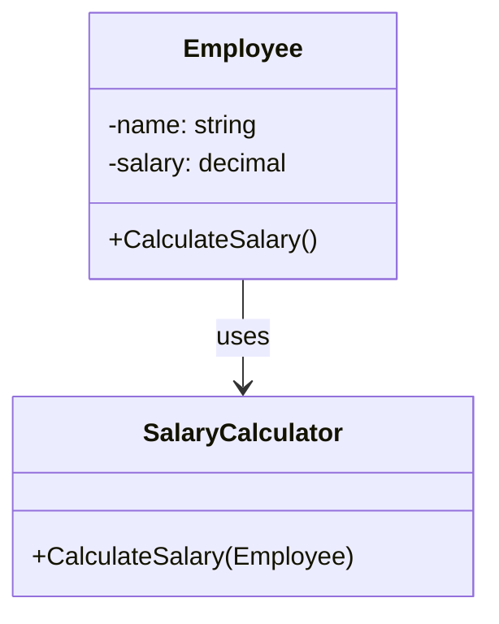
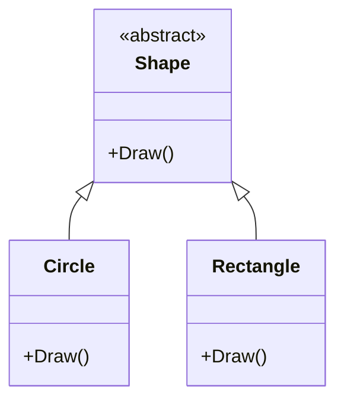
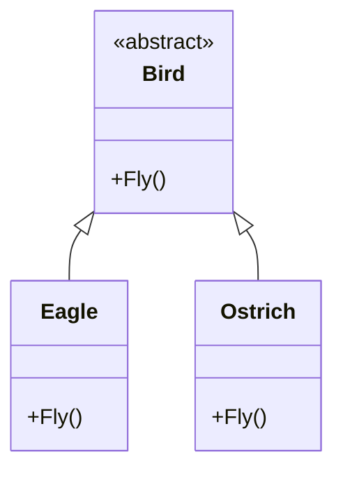
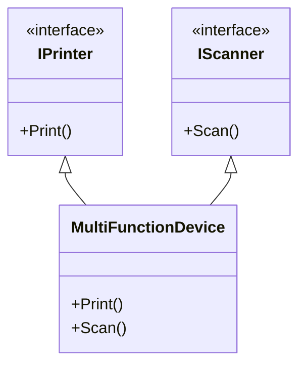
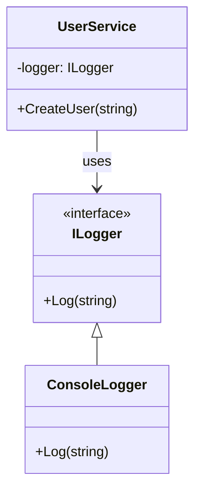

# SOLID Principles
The SOLID principles are five design principles aimed at promoting simpler, more robust, and updatable code for software development in object-oriented languages. Each letter in SOLID represents a principle for development:

## S - Single Responsibility Principle (SRP)
The Single Responsibility Principle states that a class should have only one reason to change. In other words, a class should have only one responsibility or single purpose.

**Implementation Method**: To implement SRP, identify the responsibilities of a class and ensure that it only has one reason to change. If a class has multiple responsibilities, break it down into smaller classes, each with its own responsibility.

*Code Sample (C#)*:
```C#
public class Employee
{
    public string Name { get; set; }
    public decimal Salary { get; set; }

    public void CalculateSalary()
    {
        // Calculate salary logic
    }
}

public class SalaryCalculator
{
    public decimal CalculateSalary(Employee employee)
    {
        // Calculate salary logic
        return employee.Salary;
    }
}
```
*UML Diagram:*


## O - Open-Closed Principle (OCP)
The Open-Closed Principle states that a class should be open for extension but closed for modification. This means that you should be able to add new functionality to a class without modifying its existing code.

**Implementation Method:** To implement OCP, use inheritance or interfaces to add new functionality to a class without modifying its existing code.
*Code Sample (C#)*:
```C#
public abstract class Shape
{
    public abstract void Draw();
}

public class Circle : Shape
{
    public override void Draw()
    {
        Console.WriteLine("Drawing a circle.");
    }
}

public class Rectangle : Shape
{
    public override void Draw()
    {
        Console.WriteLine("Drawing a rectangle.");
    }
}
```
*UML Diagram:*


## L - Liskov Substitution Principle (LSP)
The Liskov Substitution Principle states that subtypes should be substitutable for their base types. In other words, any code that uses a base type should be able to work with a subtype without knowing the difference.

**Implementation Method:** To implement LSP, ensure that subtypes can be used as base types without affecting the correctness of the program.
*Code Sample (C#)*:
```C#
public abstract class Bird
{
    public abstract void Fly();
}

public class Eagle : Bird
{
    public override void Fly()
    {
        Console.WriteLine("Eagle is flying.");
    }
}

public class Ostrich : Bird
{
    public override void Fly()
    {
        throw new InvalidOperationException("Ostrich cannot fly.");
    }
}
```
*UML Diagram:*


## I - Interface Segregation Principle (ISP)
The Interface Segregation Principle states that clients should not be forced to depend on interfaces they don't use. Instead, interfaces should be designed to meet the needs of specific clients.

**Implementation Method:** To implement ISP, break down large interfaces into smaller, more specific interfaces that meet the needs of specific clients.
*Code Sample (C#)*:
```C#
public interface IPrinter
{
    void Print();
}

public interface IScanner
{
    void Scan();
}

public class MultiFunctionDevice : IPrinter, IScanner
{
    public void Print()
    {
        Console.WriteLine("Printing...");
    }

    public void Scan()
    {
        Console.WriteLine("Scanning...");
    }
}
```
*UML Diagram:*


## D - Dependency Inversion Principle (DIP)
The Dependency Inversion Principle states that high-level modules should not depend on low-level modules, but both should depend on abstractions. This means that dependencies should be inverted, and high-level modules should not be directly dependent on low-level modules.

**Implementation Method:** To implement DIP, use abstractions (interfaces or abstract classes) to define dependencies between high-level and low-level modules.
*Code Sample (C#)*:
```C#
public interface ILogger
{
    void Log(string message);
}

public class ConsoleLogger : ILogger
{
    public void Log(string message)
    {
        Console.WriteLine(message);
    }
}

public class UserService
{
    private readonly ILogger _logger;

    public UserService(ILogger logger)
    {
        _logger = logger;
    }

    public void CreateUser(string username)
    {
        _logger.Log($"Creating user: {username}");
    }
}
```
*UML Diagram:*


## Conclusion

The SOLID principles are a set of guidelines for designing and developing maintainable, flexible, and scalable software systems. By following these principles, developers can create code that is easier to understand, modify, and extend.

In this README, we have explored each of the SOLID principles in detail, including the Single Responsibility Principle (SRP), Open-Closed Principle (OCP), Liskov Substitution Principle (LSP), Interface Segregation Principle (ISP), and Dependency Inversion Principle (DIP). We have also provided code samples in C# and UML diagrams using Mermaid to illustrate each principle.

By applying the SOLID principles to your software development projects, you can:

-    Reduce coupling and improve cohesion
-    Increase flexibility and scalability
-    Improve code readability and maintainability
-    Reduce bugs and errors
-    Make your code more modular and reusable

Remember, the SOLID principles are not a set of rigid rules, but rather guidelines to help you write better code. By following these principles, you can create software systems that are more robust, efficient, and easy to maintain.

## Contact
If you have any questions or need further clarification on any of the patterns, please don't hesitate to reach out to [Arya Gorjipour].


 [Arya Gorjipour]: <https://github.com/Aryagorjipour>
